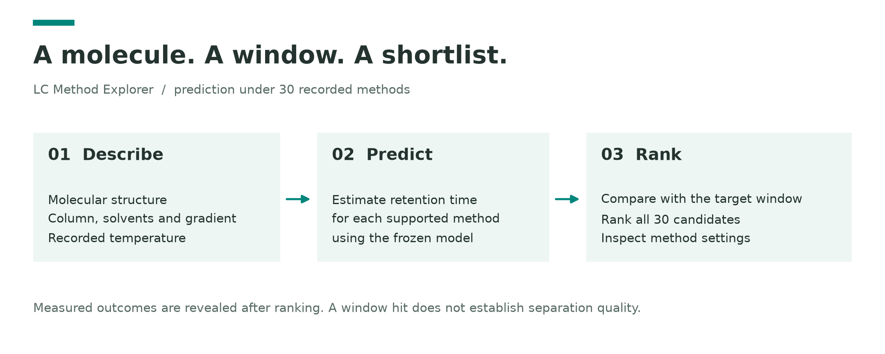
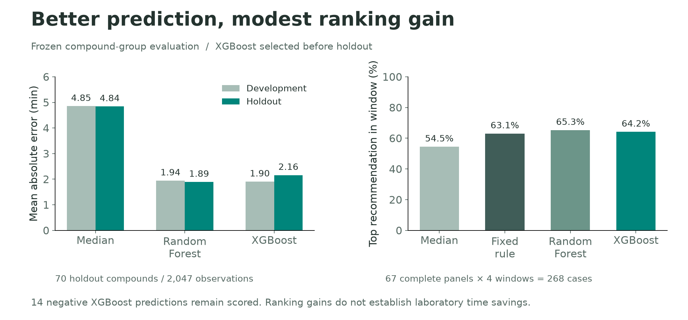
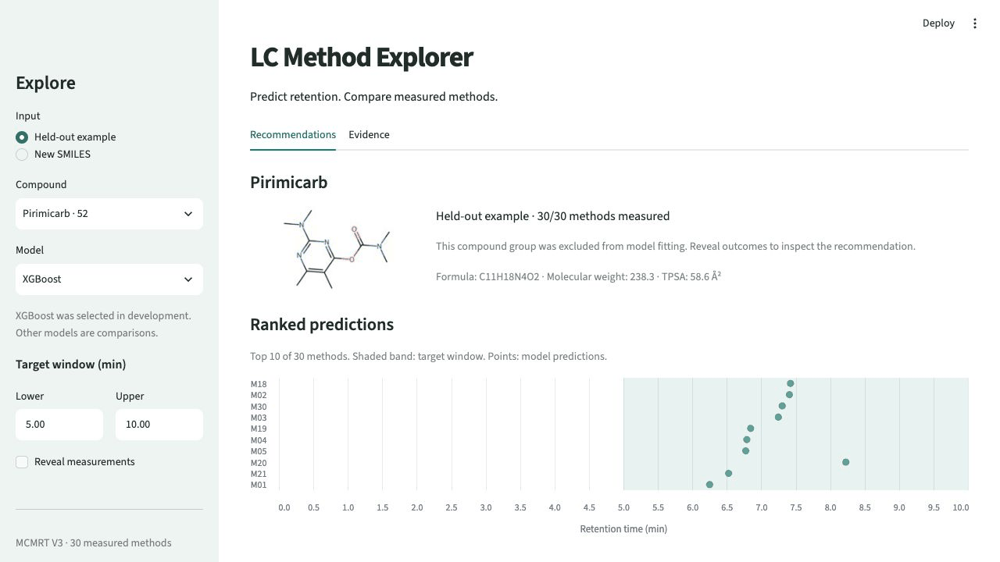
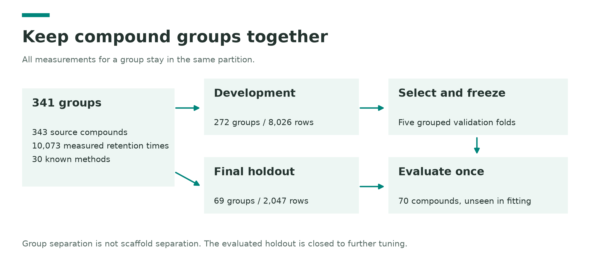

# LC Method Explorer

**Retention-time prediction and method ranking across 30 measured liquid chromatography methods.**

Given a molecular structure and a target retention-time window, this research prototype predicts retention under each supported method and ranks the candidates. Everything runs locally. The figures and recorded example below present the complete project without a hosted app.

## What the experiment shows

MCMRT V3 provides **10,073 observations, 343 source compounds and 30 methods** spanning six column products, six mobile-phase pairs and 15 gradient schedules. Of these compounds, 330 have complete method coverage. [Data audit →](reports/DATA_AUDIT.md)

| Model | Development MAE | Holdout MAE |
|---|---:|---:|
| Per-method median | 4.85 min | 4.84 min |
| Random Forest | 1.94 min | **1.89 min** |
| XGBoost | **1.90 min** | 2.16 min |

XGBoost won development validation and remains the prespecified default. Random Forest performed better on the final holdout. XGBoost's top recommendation meets the target window in **172/268 cases (64.2%)**, versus **169/268 (63.1%)** for a fixed-method rule learned from development data. This is three additional hits; statistical significance and laboratory time savings are not established.

## A recorded example

Pirimicarb, target window 5–10 minutes: rank methods, reveal measurements, and inspect the leading method's settings. This is an illustrative held-out example, not the benchmark.

[Static prediction view](reports/figures/demo_recommendations.png) · [Measured outcome](reports/figures/demo_measured.png) · [Method settings](reports/figures/demo_method.png)

## How evaluation works

Compound groups stay together across all methods. Inputs include 21 molecular descriptors plus column, solvent, temperature and gradient features. Measured retention factors and measurement precision are excluded. The evaluated holdout is closed to further tuning.

[Frozen protocol](reports/EVALUATION_PROTOCOL.md) · [Full results](reports/MODEL_RESULTS.md) · [Model card](reports/MODEL_CARD.md)

## Limits that matter

- **14 negative XGBoost predictions** remain in the evaluation and are flagged in the app.
- Validation covers unseen compound groups under familiar methods. It does not establish scaffold, new-method or new-laboratory generalization.
- A retention-window hit does not establish mixture resolution, peak shape or sensitivity.
- Ranking evaluation uses 67 complete-panel holdout compounds and four prespecified windows. Missing measurements are never treated as failures.

## Explore and reproduce

[Local setup and verification](docs/REPRODUCIBILITY.md) · [Five-slide PDF](presentation/lc-method-explorer.pdf) · [Editable PowerPoint](presentation/lc-method-explorer.pptx)

Python environments are locked. Saved results, source checksums and fixed splits are included; original model artifacts are distributed with the [v0.1.0 release](https://github.com/ogngnaoh/lc-method-explorer/releases/tag/v0.1.0). No cloud compute or app hosting is required.

## Sources and credits

Data: [MCMRT V3](https://doi.org/10.57760/sciencedb.15823), dataset record licensed CC0; [associated publication](https://www.nature.com/articles/s41597-024-03780-5). Code and original project visuals: [MIT](LICENSE). Third-party datasets retain their own terms.

Independent research project, developed with coding-assistant support. No employer affiliation or laboratory deployment is claimed.
