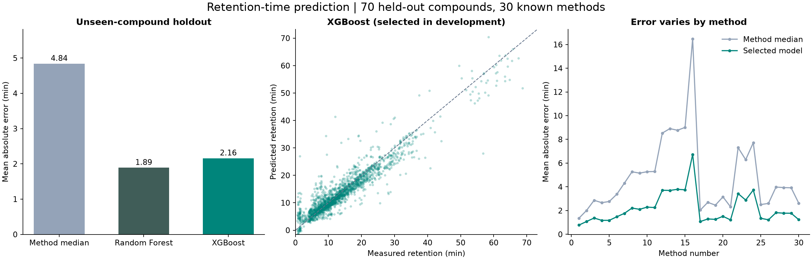
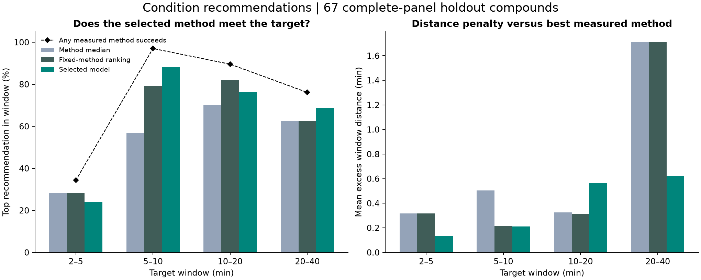

# Model and recommendation results

Experiment `mcmrt-v3-compound-v1`, completed September 24, 2026 on the local M2 Pro. No cloud training was used.

## Main finding

Both tree models reduce retention-time error substantially relative to a method-median baseline on held-out compounds. The condition-recommendation gain over a strong fixed-method rule is modest and varies by target window. Better RT prediction is not sufficient evidence of a large improvement in method selection.

## Model comparison

| Model | Development MAE (min) | Final holdout MAE (min) | Holdout RMSE (min) |
|---|---:|---:|---:|
| Per-method median | 4.8531 | 4.8423 | 7.2199 |
| Random Forest, selected configuration | 1.9437 | **1.8909** | 3.1315 |
| XGBoost, selected configuration | **1.9034** | 2.1599 | 3.4148 |

Development: 273 source compounds / 272 groups, five group folds, 8,026 out-of-fold predictions per configuration. Final holdout: 70 source compounds / 69 groups, 2,047 observations. These are within-source, unseen-compound evaluations across 30 known methods, not external-laboratory or unseen-method tests.

XGBoost was selected using development MAE before evaluating the holdout. Random Forest subsequently scored better on the holdout; the demo default remains XGBoost under the prespecified selection rule. The narrow development advantage did not establish that XGBoost would be superior on new compounds. Do not select a new winner or tune further using these holdout scores.

The selected XGBoost model reduced MAE by 2.6825 minutes relative to the median baseline. A paired compound-group bootstrap gives a 95% interval of 1.9361–3.4946 minutes for that reduction (2,000 resamples). This interval conditions on the fixed models and dataset; it excludes model-selection/training uncertainty and laboratory transfer uncertainty.

The bounded development comparison took 49.4 seconds and final refitting/evaluation 5.9 seconds within the experiment functions, excluding initial package imports/setup. Three configurations per family were compared; all results remain saved. Nine focused tests passed before training, and saved models were reloaded to check their predictions against the evaluation artifacts.

## Recommendation performance

Evaluation covers 67 complete-panel holdout compounds, each measured under all 30 methods, across four prespecified windows: 2–5, 5–10, 10–20, and 20–40 minutes. This gives 268 compound/window cases. Three holdout compounds with incomplete panels were excluded from ranking metrics but retained for RT prediction metrics. Cases from the same compound are dependent.

| Ranking approach | Top-1 window hits | Top-3 any-hit rate | Mean excess window distance |
|---|---:|---:|---:|
| Method-median predictions | 146/268 (54.5%) | 62.3% | 0.7144 min |
| Fixed-method ranking learned on development data | 169/268 (63.1%) | 64.2% | 0.6381 min |
| Random Forest predictions | 175/268 (65.3%) | 70.1% | 0.3382 min |
| XGBoost predictions, selected model | 172/268 (64.2%) | 69.8% | 0.3822 min |

At least one measured method satisfies the requested window in 199/268 cases (74.3%). XGBoost succeeds in 172/199 feasible cases (86.4%); this conditional rate must not be reported as its overall success rate.

XGBoost adds only three top-1 successes over the fixed rule across the 268 cases (1.1 percentage points). Statistical significance of that ranking difference has not been established. The stronger observed gains in top-3 coverage and excess distance are descriptive, and also vary across windows. For example, the fixed rule has better top-1 hit rates than XGBoost for the 2–5 and 10–20 minute windows.

“Excess distance” compares the selected method's measured distance outside the window with the best measured candidate's distance. It remains defined even when no method meets the window. A lower value is better. It does not measure chromatographic resolution, ionization sensitivity, or total assay cost.

## Failures and limits to carry into the demo

- XGBoost produced 14 negative predictions among 2,047 holdout observations (approximately −1.52 to −0.008 minutes). These are physically invalid and were preserved in the evaluation. Do not silently clip them or display them as credible retention times. The UI should flag them without rewriting the benchmark.
- Random Forest and the median baseline produced no negative or beyond-run predictions in this holdout. XGBoost produced no beyond-run predictions.
- Identifiers contain ten secondary-layer discrepancies. The source structures were retained and the molecular features do not resolve stereochemistry.
- No uncertainty calibration or applicability-domain threshold has been validated. Point predictions are not guarantees.
- The four timing windows are illustrative and prespecified, not scientist-approved operating requirements.
- Evaluating new methods, scaffold-disjoint chemistry, other laboratories, or mixture separation would require new experiments. This holdout is now evaluated and must not be reused as an untouched test for later model revisions.

## Reproduction and evidence

The fixed protocol is in `EVALUATION_PROTOCOL.md`, exact settings in `config/experiment.json`, and all candidate predictions, selection hashes, final predictions, and scores under `reports/experiments/mcmrt-v3-compound-v1/`. Trained local artifacts are in `models/mcmrt-v3-compound-v1/` (excluded from version control). `scripts/verify_results.py` checks artifacts without retraining; `scripts/plot_results.py` renders saved results without fitting or selection.

Initial XGBoost import failed because macOS lacked OpenMP. Installing Homebrew `libomp` 23.1.2 resolved it. Python package versions are pinned in `uv.lock`; models trained with XGBoost 3.2.0 and scikit-learn 1.9.1. No hyperparameters were changed after development comparison or final evaluation.
